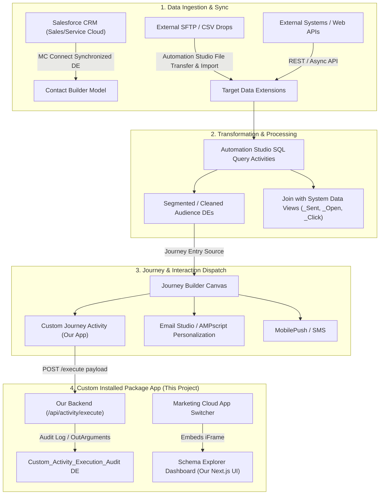
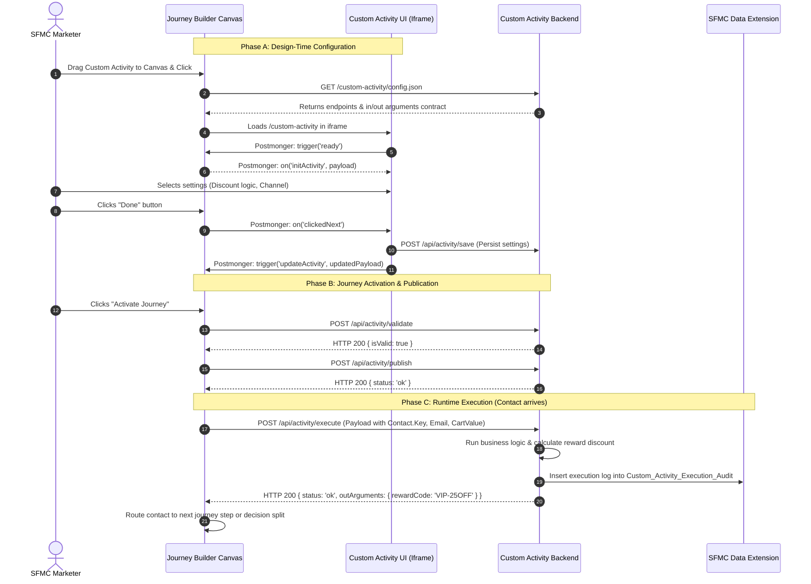
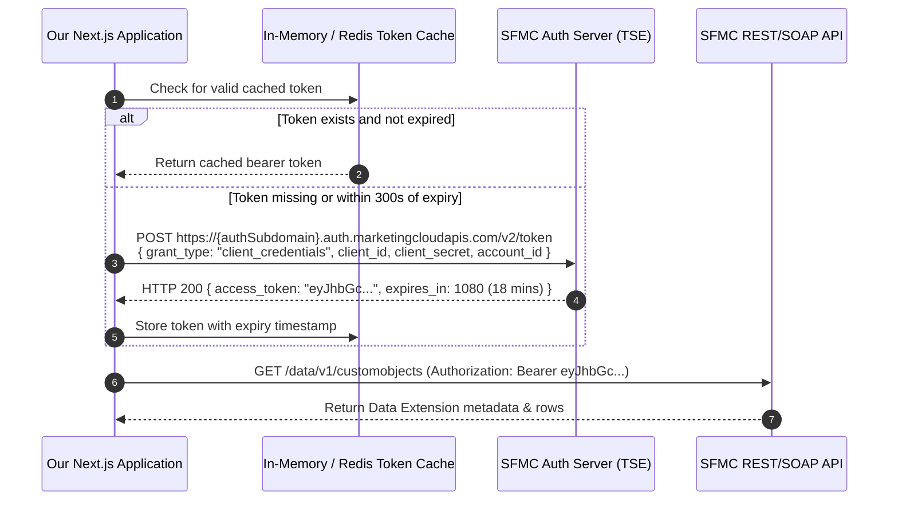
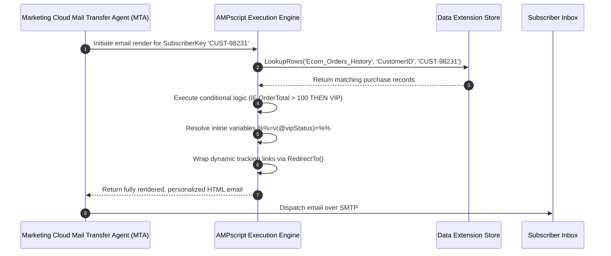

# Salesforce Marketing Cloud (SFMC) Developer Master Learning Guide & Architecture Flows

This document is your in-depth study companion, architectural reference, and flow manual for mastering SFMC Development (covering enterprise architectures and the **Marketing Cloud Developer MCD-101** certification).

---

## 🗺️ High-Level Architectural Flow of SFMC

---

## 🔄 Sequence Flows for Core Developer Scenarios

### Flow 1: Journey Builder Custom Activity Lifecycle & Runtime Execution
Understanding how SFMC interacts with your custom activity during configuration vs. live journey execution:

---

### Flow 2: OAuth 2.0 Server-to-Server Token Handshake Flow
How your application authenticates with SFMC to query REST/SOAP APIs:

---

### Flow 3: Email Personalization at Send-Time (AMPscript Flow)
How Marketing Cloud compiles dynamic content before message delivery:

---

## 📚 In-Depth Domain Breakdown & Key Concepts

### 1. 📜 Scripting & Programmatic Languages

#### A. AMPscript
- **Execution Lifecycle**: Evaluates procedurally from top to bottom at send time for every subscriber.
- **Key Best Practices**:
  - Always check `RowCount()` on rowsets returned by `LookupRows()` before attempting `Row(rowset, 1)` to prevent fatal email send pauses.
  - Wrap any dynamic landing page link in `RedirectTo()` to ensure click tracking is retained.
  - Use `TreatAsContent()` when pulling dynamic code or HTML strings from Data Extensions that need to be evaluated as AMPscript.

#### B. Server-Side JavaScript (SSJS)
- **Engine**: Runs EcmaScript 3 / JavaScript 1.5 in a secure sandbox on SFMC servers.
- **When to Choose SSJS over AMPscript**:
  - Advanced JSON handling (`Platform.Function.ParseJSON()` / `Stringify()`).
  - Complex nested loops or multi-dimensional arrays.
  - Using `try / catch` blocks to gracefully handle unexpected faults.
  - Calling the SOAP API at high throughput via the **WSProxy** object (`new Script.Util.WSProxy()`).

#### C. Guide Template Language (GTL)
- Mustache/Handlebars template syntax designed for rendering JSON payloads without repetitive AMPscript loop counters.

---

### 2. 🗄️ Data Architecture & Modeling

#### A. Data Extensions (DEs)
- **Sendable DE**: Contains a designated field mapped directly to `Subscriber Key` or `Contact Key`.
- **Non-Sendable DE**: Reference tables, audit logs, or relational tables (like order line items).
- **Data Retention**: Configurable row-level or table-level retention (deletes rows after $X$ days).
- **Field Lengths**: Keep fields bounded (e.g. `Text(50)` instead of `Text(4000)`) to maintain SQL query indexing performance.

#### B. Contact Model & Identity
- **Contact Key**: Unique, omni-channel identifier that persists across Email, SMS, MobilePush, and WhatsApp.
- **Subscriber Key**: Channel-specific delivery key used inside Email Studio.
- **Attribute Groups**: Linking Data Extensions via relational cardinalities (1:1, 1:Many) in Contact Builder to make them accessible inside Journey Builder decision splits.

---

### 3. ⚙️ Automation Studio & SQL Activities

#### A. Automation Studio Steps
1. **File Transfer Activity**: Unzips or moves files from SFMC Safehouse to External FTP / S3.
2. **Import Activity**: Parses CSV files and populates or updates Data Extensions.
3. **SQL Query Activity**: Runs T-SQL queries (maximum execution limit: 30 minutes).
4. **Data Extract Activity**: Extracts tracking data or converts DEs into zipped CSV files.
5. **Script Activity**: Executes hosted SSJS files.

#### B. System Data Views (Essential SQL Reference)
- `_Subscribers`: Tracks Master subscriber email, status (`Active`, `Bounced`, `Held`, `Unsubscribed`).
- `_Sent`: Logs every email dispatch (`JobID`, `ListID`, `BatchID`, `SubscriberKey`, `EventDate`).
- `_Open`: Open tracking events.
- `_Click`: Click tracking events and destination URLs.
- `_Bounce`: Bounce logs (`BounceCategory`, `SMTPCode`, `Reason`).
- `_JourneyActivity`: Logs when contacts enter and execute individual Journey Builder steps.

---

### 4. 📡 APIs & System Integration (Installed Packages)

#### Installed Package Components:
1. **API Integration**: Server-to-Server or Web App OAuth credentials.
2. **Marketing Cloud App**: Web app iframe URL displayed in the SFMC App Switcher.
3. **Journey Builder Custom Activity**: Integration endpoint defined via `config.json`.
4. **Custom Content Block**: Content Builder extensions using the Content Block SDK.

---

## 🚀 How This Project Implements These Concepts

| SFMC Concept | Where It Is Implemented In This Project |
| :--- | :--- |
| **Installed Package Web App** | [`src/app/page.tsx`](file:///media/k/New%20Volume/workstation/Full-Stack/sfmc-dev/src/app/page.tsx) — Interactive Schema Explorer & Audit Dashboard |
| **Custom Journey Activity Manifest** | [`src/app/custom-activity/config.json/route.ts`](file:///media/k/New%20Volume/workstation/Full-Stack/sfmc-dev/src/app/custom-activity/config.json/route.ts) |
| **Custom Activity Config UI** | [`src/app/custom-activity/page.tsx`](file:///media/k/New%20Volume/workstation/Full-Stack/sfmc-dev/src/app/custom-activity/page.tsx) |
| **Journey Activity Lifecycle APIs** | [`src/app/api/activity/execute/route.ts`](file:///media/k/New%20Volume/workstation/Full-Stack/sfmc-dev/src/app/api/activity/execute/route.ts), `save`, `publish`, `validate` |
| **Testing / Simulation Sandbox** | [`src/app/simulator/page.tsx`](file:///media/k/New%20Volume/workstation/Full-Stack/sfmc-dev/src/app/simulator/page.tsx) |
| **Knowledge Hub & Code Recipes** | [`src/app/knowledge-hub/page.tsx`](file:///media/k/New%20Volume/workstation/Full-Stack/sfmc-dev/src/app/knowledge-hub/page.tsx) |
